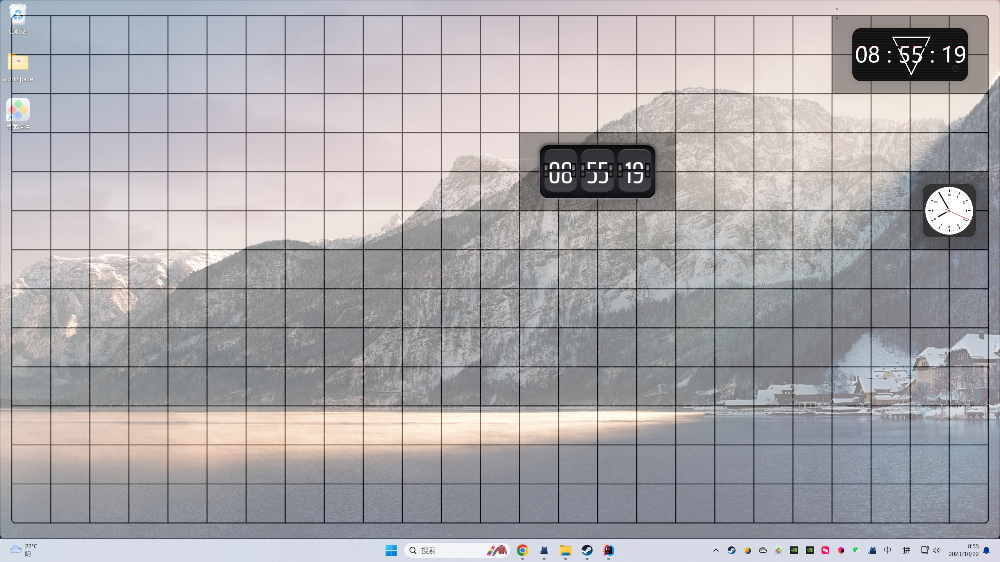
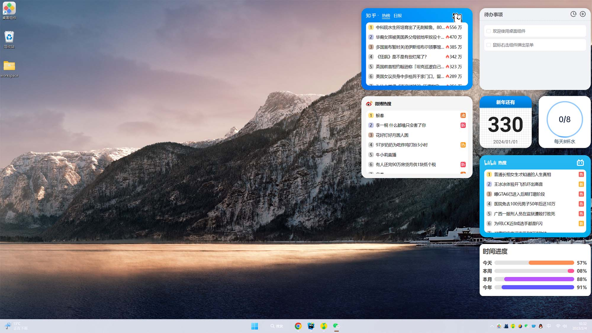
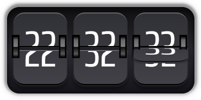
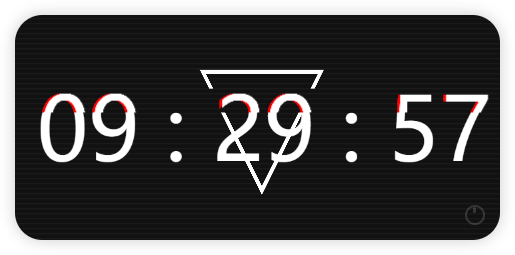
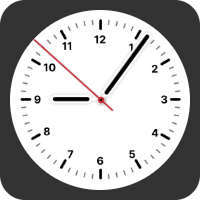

<p align="center">
<a href="https://github.com/widget-js/widgets">
  
</a>
<br>
桌面组件 - 时钟组件
</p>

<p align="center">
  
  <a href="https://discord.gg/vwSAaRR8cT"></a>
</p>



### 说明

这是桌面组件前端开源组件，项目还在持续完善中

### 全部组件地址

https://github.com/widget-js/widgets


### Windows 10/11 客户端下载

1. https://www.microsoft.com/store/productId/9NPR50GQ7T53
2. https://widgetjs.cn

### 运行项目

#### 1.下载并运行桌面组件客户端

1. https://www.microsoft.com/store/productId/9NPR50GQ7T53
2. https://widgetjs.cn

#### 2.克隆代码

```shell
#克隆代码
git clone https://github.com/widget-js/widget.git

```

#### 3.到项目目录下载依赖

```shell
pnpm install
```

#### 4.运行

```shell
pnpm dev
```

### 创建自己的组件

```shell
// 安装组件脚手架
pnpm install -g @widget-js/cli
// 在项目根目录运行 创建组件命令
widget create
```

### 组件列表

#### 翻页时钟(src/widgets/flip-clock)



#### Glitch时钟(src/widgets/glitch)



#### 时钟(src/widgets/glitch)


